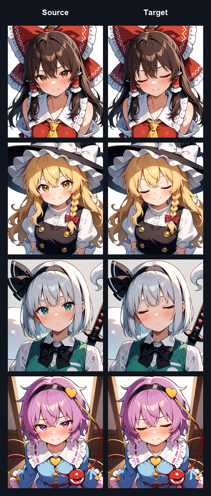
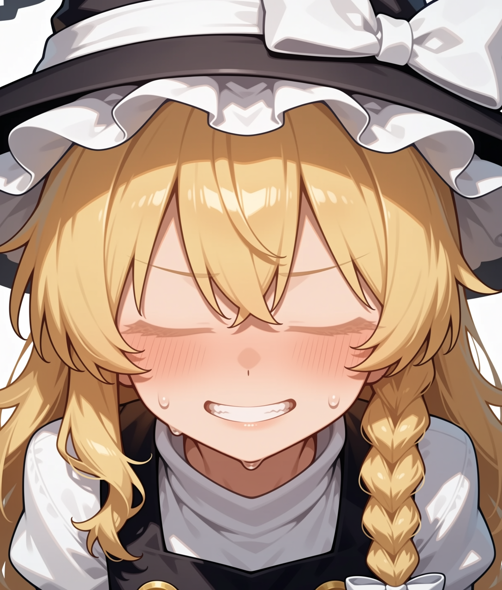

# Anima ADDifT Trainer

[简体中文](README_zh-CN.md)

A standalone trainer dedicated to Anima ADDifT paired-image LoRA training.

The training backend uses the `paired_difference_mode` implementation extracted
from the recent uncommitted changes in Anima Standalone Trainer. The WebUI uses
a focused Source → Target layout and does not include unrelated training modes.

## Results

The following four pairs were used for training. Source images with open eyes
are shown on the left, and Target images with closed eyes are shown on the
right.



After 100 training steps, the LoRA can produce the closed-eye effect on a
character that was not included in the training pairs:



PNG workflow, prompt, and other metadata have been removed from all showcase
images.

## Known Issues

- Training a closed-eye LoRA can make the closed-eye line color lighter. The
  generated eyelid or eyelash lines may appear paler than the corresponding
  hard, dark lines in the Target images.
- If a hard-edged circle is added to every character's nose in the Target
  images, the trained LoRA tends to generate a soft-edged circle with a
  feathered appearance instead of preserving the hard boundary.

## Launch

Portable environment:

```text
start_training_ui_portable.bat
```

Project virtual environment or system Python:

```text
start_training_ui.bat
./start_training_ui.sh
```

Open `http://127.0.0.1:3001`.

## Dataset Direction

```text
Source image (before) → Target image (after)
```

Images must be paired by filename stem:

```text
source/001.png
target/001.png
```

Captions are stored beside the Target images, for example `target/001.txt`.

A positive multiplier applies the Target effect, while a negative multiplier
removes it. The backend alternates both directions automatically, so a separate
reverse-pair option is unnecessary.

## UI Parameters

- **Slider Scale:** signed LoRA multiplier used during training.
- **Timestep:** try `500-1000` for localized decorations or structural edits;
  start around `200-400` for color or style changes.
- **Soft Difference Mask:** emphasizes latent regions that differ between
  Source and Target.
- **Mask Area Normalize:** prevents small edits from being diluted when loss is
  averaged over the complete image.
- **Background Weight:** minimum supervision retained in unchanged regions.

## Main Files

- `anima_train_addift.py`: dedicated entry point that forces ADDifT mode.
- `tools/anima_addift_webui.py`: single-page WebUI, pair validation, and
  training-process management.
- `anima_train_network.py`: ADDifT prediction-matching implementation.
- `train_network.py`: shared training loop.

See `PAIRED_DIFFERENCE_TRAINING.md` for details about the objective.

## License

Project-specific original code is released under the
[MIT License](LICENSE). Components derived from upstream projects remain
subject to the [Apache License 2.0](LICENSE-APACHE-2.0.md). See
[NOTICE](NOTICE) for attribution details.

## References

- [tukisuwa/sd-scripts](https://github.com/tukisuwa/sd-scripts)
- [hako-mikan/sd-webui-traintrain](https://github.com/hako-mikan/sd-webui-traintrain)
- [gazingstars123/Anima-Standalone-Trainer](https://github.com/gazingstars123/Anima-Standalone-Trainer)
